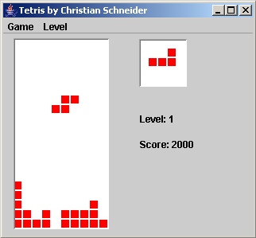

javatris
========

I chose to write a game like Tetris as my first game as it is a simple Concept without any need to create fancy 
graphics beforehand. The game was written from scratch with the Java IDE Eclipse. I used the VE plugin to layout
the Swing components. To help others learn java and game programming I will add some Documentation to this site to 
explain some of the concepts.

 
